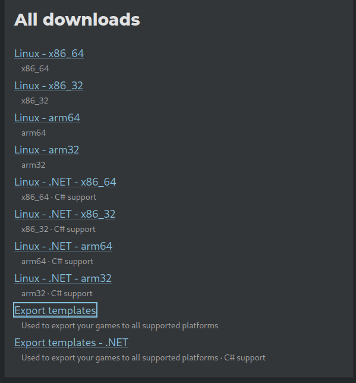
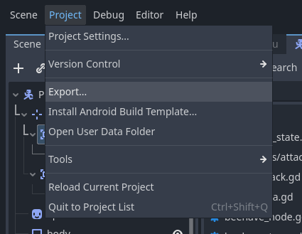
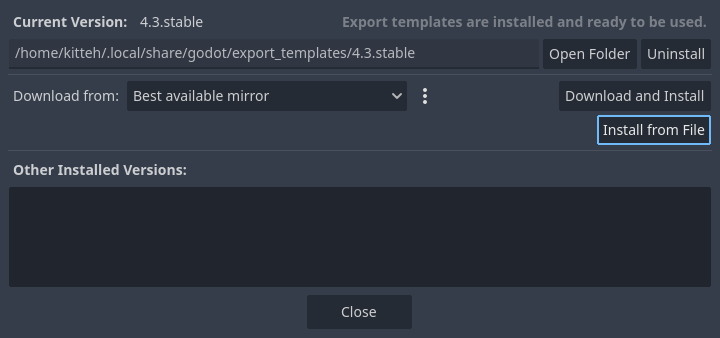
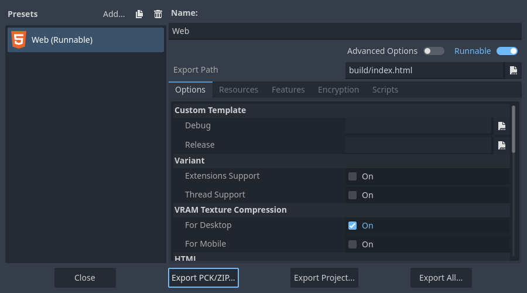

1. Download the export template from (the official website)[https://www.godotengine.org/download]
	
2. Create a folder called "build" inside the "godot" folder in the project
3. Export the project 
	
3. If you have not set up the export template, Godot will ask you to install a compatible export template.  Click "Install from File" and choose the template you downloaded
	
4. Choose the web export preset and click Export Project, then press Save
	
5. This will export a HTML5 version of the game in the build folder
6. Create a compressed (zip) archive of the folder and upload to [itch.io](https://itch.io/game/edit/3231410) (The password is the jam theme)
7. Load the page and ensure it is playable