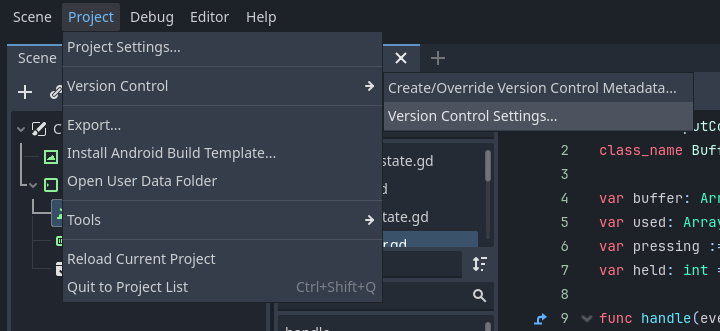
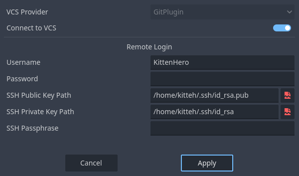
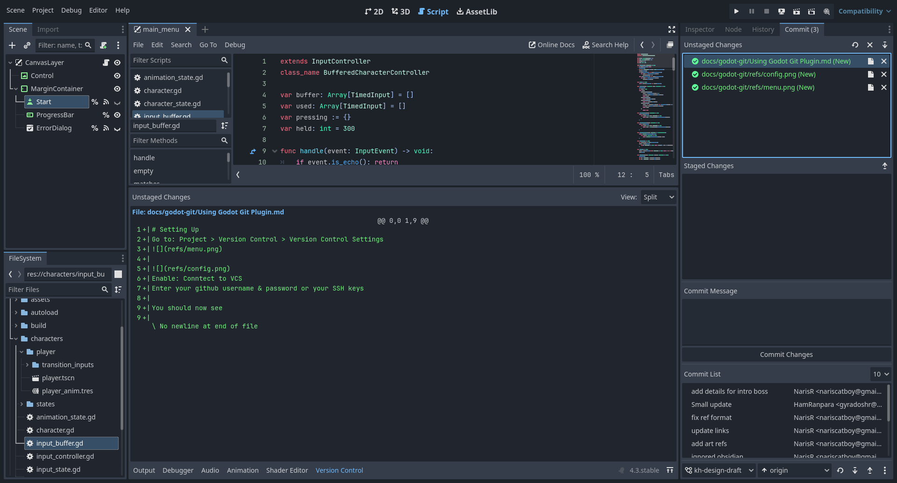

# Setting Up
Go to: Project > Version Control > Version Control Settings

Enable: Connect to VCS
Enter your GitHub username and SSH keys or you can generate a [Personal Account Token](https://docs.github.com/en/authentication/keeping-your-account-and-data-secure/managing-your-personal-access-tokens) and use it as a password

You should now see the "Commit" tab next to the Inspector, and a Version Control Tab next to the Output

You can click files or commits in the commit tab and see the changes in that file or commit in the Version Control tab.

# Making a commit
Click on a file and hit Enter to stage or unstage a file to a commit, or use the arrow buttons to un/stage all files.  Once you have chosen the files you want to include, add a message and click "Commit Changes"

# Interacting with remote
You can change branches at the bottom of the commit panel.
You can click the arrow buttons to fetch, pull, or push
You can use the menu to create or remove branches and remotes